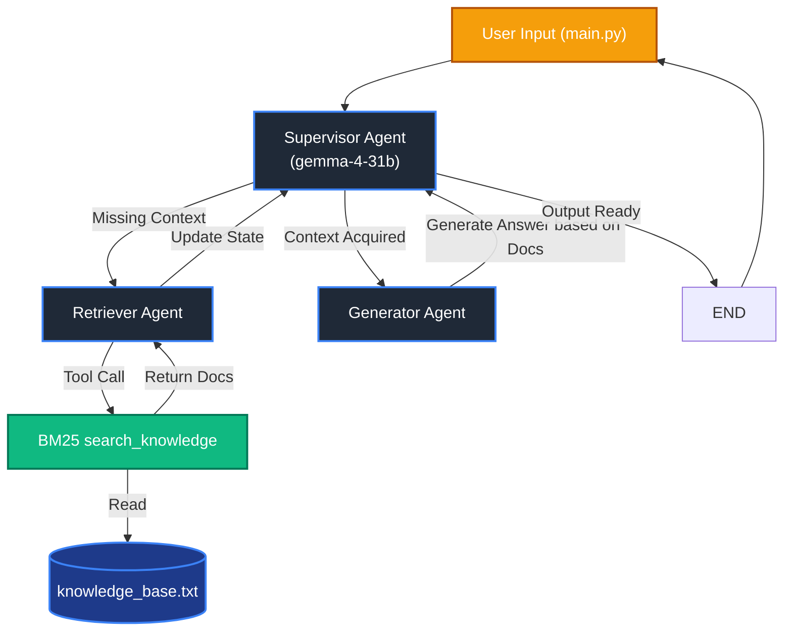

# Agentic RAG Policy Assistant

An advanced, multi-agent Retrieval-Augmented Generation (RAG) system built with LangGraph and LangChain. This intelligent assistant is designed to answer questions about internal corporate policies (Company A) by employing a Supervisor agent to coordinate a Retriever agent (using BM25 search) and a Generator agent, powered by the **gemma-4-31b** model.

---

## Component & Directory Mapping

The project is structured to separate the agent workflow definitions, state management, and knowledge base resources:

### 1. Core Execution

- **Directory:** `./` (Root)
- **Purpose:** Entry points, dependencies, and raw data resources.
- **Key Files:**
  - `main.py`: The interactive CLI application that initializes the LangGraph workflow and handles user input loops.
  - `knowledge_base.txt`: The comprehensive corporate policy document used as the source of truth for RAG.
  - `requirmentst.txt`: Python package dependencies (note the spelling when installing).

### 2. Multi-Agent Workflow Logic

- **Directory:** `scripts/`
- **Purpose:** Contains the definitions for the LLM agents, state schemas, and the LangGraph orchestrator.
- **Key Files:**
  - `workflow.py`: Constructs the `StateGraph`, defining nodes (agents) and conditional routing edges.
  - `agents.py`: Implements the core logic and prompts for the `supervisor_agent_node`, `retrieve_agent_node`, and `generator_agent_node`.
  - `tools.py`: Contains the `search_knowledge` tool which implements a BM25 Okapi text chunk search.
  - `config.py`: Initializes the Google Generative AI client using the **gemma-4-31b-it** model and defines schemas.
  - `state_graph.py`: Defines the `GraphState` schema (question, documents, answer) passed between nodes.

### 3. Execution Artifacts

- **Directory:** `output/`
- **Purpose:** Stores visual artifacts such as screenshots of the agent workflow outputs and terminal executions.
- **Key Files:**
  - `Output1.png` - `Output4.png`: Example traces and execution logs from previous sessions.

---

## System Architecture

The system utilizes a Supervisor-worker architecture powered by LangGraph, routing the user query based on the current context state:



---

## Getting Started & Installation

Follow these steps to set up and run this project locally.

### Prerequisites

- Python 3.9+
- A Google Gemini API Key (to access `gemma-4-31b-it`)

### Installation Steps

1. **Clone the repository:**

   ```bash
   git clone <repo_url>
   cd Rag-agent-as-tool
   ```

2. **Set up a virtual environment (Recommended):**

   ```bash
   python -m venv venv
   # On Windows
   venv\Scripts\activate
   # On macOS/Linux
   source venv/bin/activate
   ```

3. **Install dependencies:**

   ```bash
   pip install -r requirmentst.txt
   ```

4. **Configure Environment Variables:**
   Create a `.env` file in the root directory by copying the template below.

5. **Start the application:**
   ```bash
   python main.py
   ```

---

## Environmental Configuration (.env)

The application requires the following environment variables. Ensure these are set in your `.env` file before booting the system.

```env
# ==========================================
# Generative AI Configurations
# ==========================================
# [Required] Your Google API key with access to gemma-4-31b-it
GOOGLE_API_KEY=your_google_api_key_here
```
